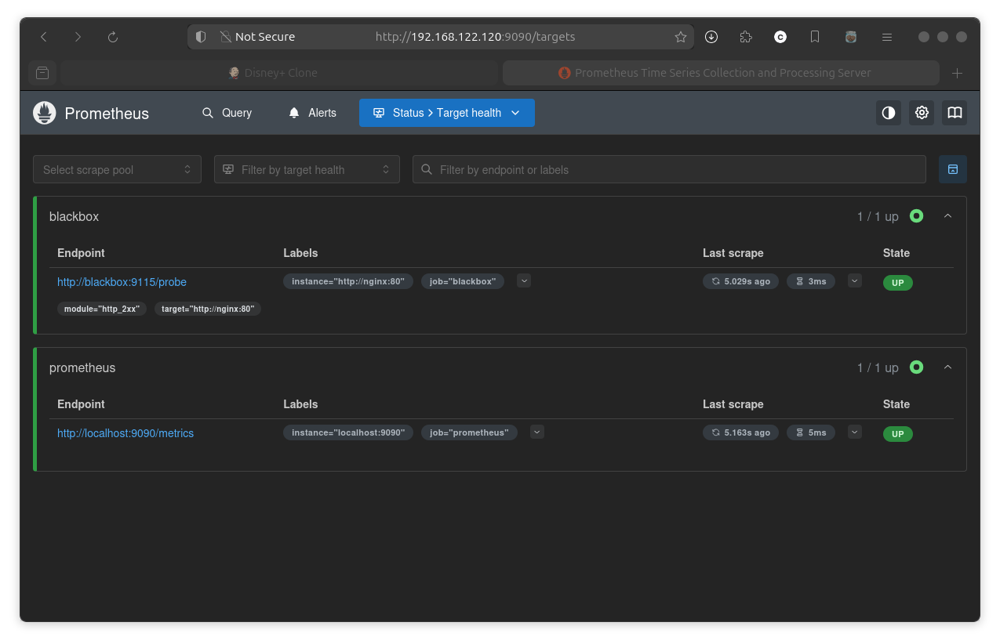

# Self-Healing Infrastructure

This project implements a self-healing infrastructure using Prometheus, Alertmanager, Blackbox Exporter, and a Flask-based webhook with Ansible to monitor an NGINX container and automatically restart it when it goes down. The system detects HTTP failures via the `NginxHttpDown` alert and triggers an Ansible playbook to restart the `self-healing-infrastructure-nginx-1` container.

## Table of Contents
- [Overview](#overview)
- [Architecture](#architecture)
- [Prerequisites](#prerequisites)
- [Project Structure](#project-structure)
- [Setup Instructions](#setup-instructions)
- [Testing the Self-Healing Mechanism](#testing-the-self-healing-mechanism)
- [Troubleshooting](#troubleshooting)

## Overview
The self-healing infrastructure monitors an NGINX container using Prometheus and Blackbox Exporter. When the NGINX HTTP endpoint is down for more than 1 minute, Prometheus triggers the `NginxHttpDown` alert, which is sent to Alertmanager. Alertmanager forwards the alert to a Flask webhook, which runs an Ansible playbook to restart the NGINX container. The system is deployed using Docker Compose.

## Architecture
- **NGINX**: Serves HTTP content and is monitored for availability.
- **Prometheus**: Scrapes metrics from Blackbox Exporter and evaluates alerting rules.
- **Blackbox Exporter**: Probes the NGINX HTTP endpoint (`http://nginx:80`) to check availability.
- **Alertmanager**: Receives alerts from Prometheus and forwards them to the webhook.
- **Webhook**: A Flask application that receives alerts and runs an Ansible playbook.
- **Ansible**: Executes the `restart_nginx.yaml` playbook to restart the NGINX container via the Docker API.

## Prerequisites
- **Docker**: Version 20.10 or higher.
- **Docker Compose**: Version 2.0 or higher.
- **Python**: Version 3.11 (used in the webhook container).
- **Git**: For cloning the repository.
- **Linux Host**: Recommended for Docker socket access (`/var/run/docker.sock`).

## Project Structure
<pre>
Self-Healing Infrastructure
├── alertmanager/
│   └── alertmanager.yaml
├── playbooks/S
│   └── restart\_nginx.yaml
├── prometheus/
│   ├── prometheus.yaml
│   └── alerts.yaml
├── webhook/
│   ├── app.py
│   ├── Dockerfile
│   └── entrypoint.sh
├── docker-compose.yaml
└── README.md
</pre>

## Setup Instructions
1. **Clone the Repository**:
   ```bash
   git clone <repository-url>
   cd self-healing-infrastructure
   ```
2. **Build and Start Services**:
    ```bash
    docker-compose build --no-cache
    docker-compose up -d --build
    ```
    

3. **Verify Setup:Check running containers**
    ``` bash
    docker ps -a
    ```
   >Should show self-healing-infrastructure-nginx-1, prometheus, alertmanager, blackbox, and webhook.

***

## Test webhook health 

```bash
curl http://localhost:5001/health
```

Test webhook: Open http://localhost:5001/health in a browser.

  

>Expected Output: ok

## Test Alertmanager 

Open http://localhost:9093 in a browser.

  

## Test nginx-server 
### Open http://localhost:8080 in a browser.

 

## Verify Services

### Prometheus: http://localhost:9090 (check targets: blackbox and nodedWebhook)
 

## TroubleshootingError 
### killing the docker server of nginx then executing it through AlertManager:
```bash
docker kill <container-name>
```
 


 

 
 
 
 
 
 
 

 


---
<br></br> 
> - **NOTE Rest of Content**: Unchanged from the previous version, including configurations, setup instructions, troubleshooting for the `http+docker` error, and optional CPU monitoring.


